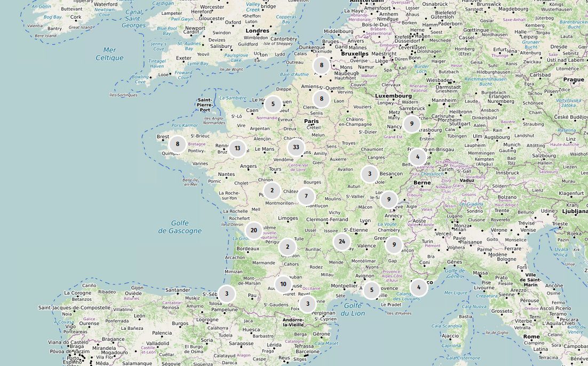

```{r, echo=FALSE, warning=FALSE, message = FALSE}

library(tidyverse)
library(wesanderson)
library(forcats)
library(plotly)

knitr::opts_chunk$set(echo=FALSE, warning = FALSE, message = FALSE)
```

## Introduction

En février 2026, l'AAF a appelé les candidat·es des élections municipales à prendre position en faveur des archives communales : [lien vers le communiqué de presse](https://www.archivistes.org/elections-2026-laaf-appelle-les-futur-es-maires-a-sengager-en-faveur-des-archives-communales/).

190 candidat·es ont répondu à cet appel.

En complément de la carte présentant la répartition géographique des personnes ayant répondu à l'appel, voici quelques éléments d'analyses complémentaires.



```{=html}
<a href="//umap.openstreetmap.fr/fr/map/election-municipales-2026-les-candidats-engages-po_1369645?scaleControl=false&miniMap=false&scrollWheelZoom=true&zoomControl=true&editMode=disabled&moreControl=true&searchControl=null&tilelayersControl=null&embedControl=null&datalayersControl=true&onLoadPanel=none&captionBar=false&captionMenus=true">Voir en plein écran</a></p>
```
```{r, echo=FALSE}
data <- read.csv2(file = "engagement_final.csv", sep = ",")
```

## Dates d'engagement

L'appel a eu lieu entre le mois de février et mars 2026[^1].

[^1]: [Fichier consolidé des données utilisé](https://github.com/ALDonzel/AAF-municipales-2026/blob/main/engagement_final.csv).

```{r}
date <- data %>% 
    group_by(date_eng) %>% 
    count()

date$date_eng <- as.Date(date$date_eng, format = "%d-%m-%y")

date %>% 
  ggplot(aes(x=date_eng, y=n, group = 1)) +
    geom_area( fill="#69b3a2", alpha=0.4) +
    geom_line(color="#69b3a2", size=1) +
    geom_point(size=2, color="#69b3a2") +
    ggtitle("Date des engagements") +
    ylab("Nombre") +
    xlab("Date")

```

## Répartition genrées

```{r, echo=FALSE}
sexe <- data %>% 
    group_by(Sexe) %>% 
    count(Sexe)

ggplot(sexe, aes(x= Sexe, y=n, fill=Sexe)) +
    geom_bar(stat = "identity") +
    scale_fill_manual(values= wes_palette("FantasticFox1")) +
    theme(legend.position='none') +
    ggtitle("Répartition des engagements par sexe") +
    ylab("Nombre")

```

## Position sur la liste

Une très large partie des réponses proviennent de tête de liste.

```{r, echo=FALSE}
pos <- data %>% 
    group_by(Tête.de.liste) %>% 
    count(Tête.de.liste)

ggplot(pos, aes(x= Tête.de.liste, y=n, fill=Tête.de.liste)) +
    geom_bar(stat = "identity") +
    scale_fill_manual(values= wes_palette("FantasticFox1")) +
    theme(legend.position='none') +
    ggtitle("Position sur la liste") +
    ylab("Nombre") +
    xlab("Tête de liste")

```

## Les nuances de liste

La liste des nuances est celle présente au sein des données du Ministère de l'Intérieur[^2].

[^2]: Jointure avec le jeu de données [Elections municipales 2026 - Listes candidates au premier tour](https://static.data.gouv.fr/resources/elections-municipales-2026-listes-candidates-au-premier-tour/20260313-152615/municipales-2026-candidatures-france-entiere-tour-1-2026-03-13.csv) du Ministère de l'Intérieur.

```{r, echo=FALSE}
nuance <- data %>% 
    group_by(Nuance.de.liste) %>% 
    count(Nuance.de.liste)

ggplot(nuance, aes(x=reorder(Nuance.de.liste, n), y=n)) +
    geom_bar(stat = "identity") +
    coord_flip() +
    theme(legend.position='none') +
    ggtitle("Nuances des candidats") +
    ylab("Nombre") +
    xlab("Nuance politique")

```

## Les personnes engagées ont-elles été élues ?

La liste des personnes élues est réalisée à partir des données des deux tours[^3]. Ici, la notion de "personnes élues" désigne toutes celles et ceux qui, à l'issu des deux tours, siègent au conseil municipal. Ces personnes peuvent donc être élues de la liste arrivée en tête ou des listes d'opposition.

[^3]: Jointure réalisée avec les données des résultats publiées par le Ministère de l'Intérieur du [premier](https://static.data.gouv.fr/resources/elections-municipales-2026-resultats-du-premier-tour/20260320-164100/municipales-2026-candidats-elus-france-entiere-tour-1-2026-03-20.csv) et du [second](https://static.data.gouv.fr/resources/elections-municipales-2026-resultats-du-scond-tour/20260323-180122/municipales-2026-candidats-elus-france-entiere-tour-2-2026-03-23.csv) tour.

```{r, echo=FALSE}
elu <- data %>% 
    group_by(Elu) %>% 
    count(Elu)

ggplot(elu, aes(x= Elu, y=n, fill=Elu)) +
    geom_bar(stat = "identity") +
    scale_fill_manual(values= wes_palette("FantasticFox1")) +
    theme(legend.position='none') +
    ggtitle("Les personnes ont-elles été élues ?") +
    ylab("Nombre") +
    xlab("Résultat")

```
